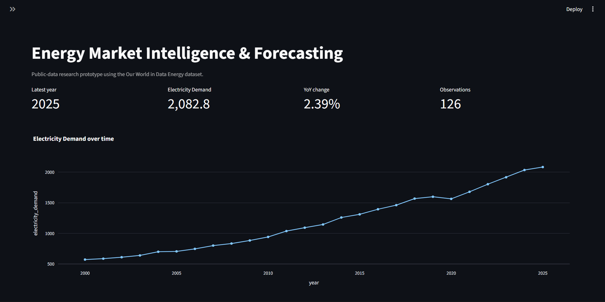
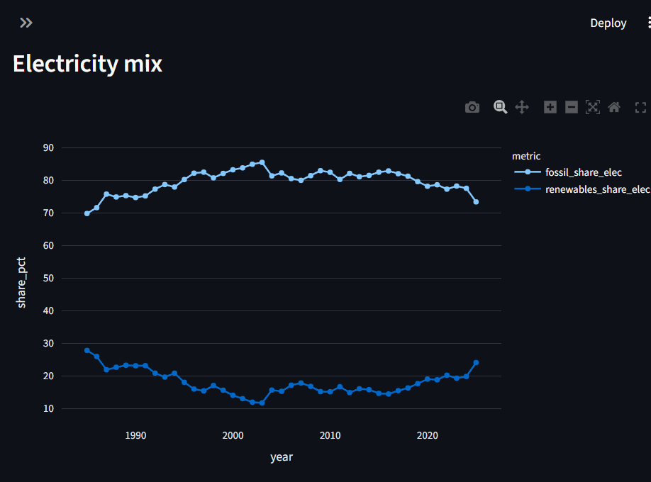
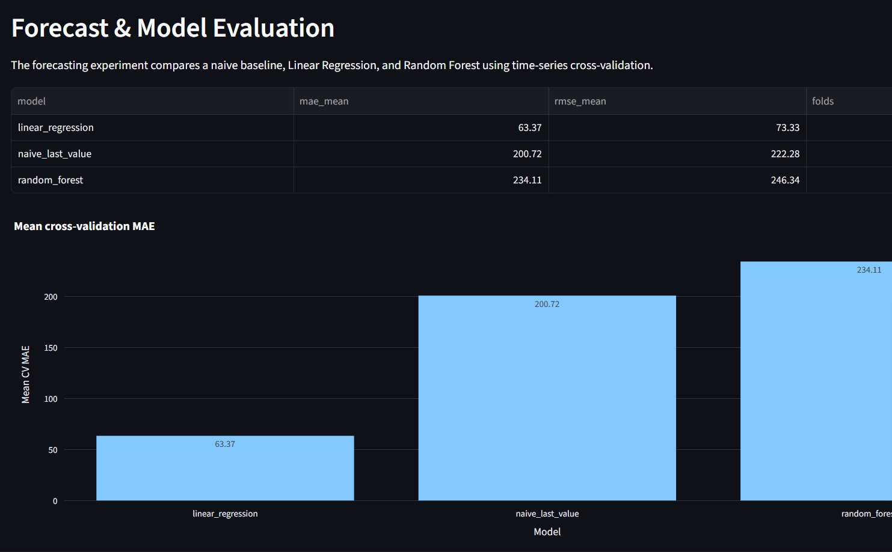
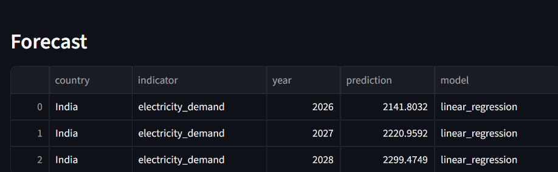

# ⚡ Energy Market Intelligence & Forecasting Platform

An end-to-end **Python + SQL + machine-learning energy analytics project** that turns public energy data into validated analytical datasets, model comparisons, forecasts, and interactive dashboards.

**Workflow:** `Collect → Clean → Validate → Analyse → Forecast → Communicate`

> Portfolio project using public data. No proprietary company data is used.

## Dashboard

### Market Overview


### Energy Mix


### Forecast & Model Evaluation


### Data Quality


## What it demonstrates

- **Python:** ingestion, transformation, analysis, automation and reusable pipeline modules
- **SQL / PostgreSQL:** relational schema design for energy facts, geography, metrics and forecasts
- **Data quality:** duplicate-key, missingness, negative-value, annual-gap and outlier checks
- **Analytics:** YoY growth, rolling averages, CAGR and energy-mix analysis
- **Machine learning:** baseline, Linear Regression and Random Forest comparison
- **Model validation:** 4-fold time-series cross-validation using MAE and RMSE
- **Dashboarding:** interactive Streamlit analytics and Power BI-ready exports
- **Research communication:** methodology, source traceability and limitations

## Verified local run

The current local run used the public Our World in Data Energy dataset and produced:

| Metric | Result |
|---|---:|
| Curated records | **23,377** |
| Source columns | **131** |
| Duplicate country-year rows | **0** |
| Data quality check | **PASS** |
| Forecast target | **India electricity demand** |
| Validation folds | **4** |
| Model selected by mean CV MAE | **Linear Regression** |

### Model comparison

| Model | Mean CV MAE (TWh) | Mean CV RMSE (TWh) |
|---|---:|---:|
| Linear Regression | **63.37** | **73.33** |
| Naive Last Value | 200.72 | 222.28 |
| Random Forest | 234.11 | 246.34 |

The metrics above are **error metrics**, not accuracy percentages.

### Forecast generated in the current run

| Year | Prediction (TWh) | Model |
|---|---:|---|
| 2026 | 2141.80 | Linear Regression |
| 2027 | 2220.96 | Linear Regression |
| 2028 | 2299.47 | Linear Regression |

These are outputs of the current research prototype and should not be interpreted as investment, commodity-price, or market-advice forecasts.

## Architecture

```text
                 Public Energy Dataset
                          │
                          ▼
                   Data Ingestion
                          │
                          ▼
                Cleaning & Validation
                          │
                          ▼
                   Transformation
                          │
                ┌─────────┴─────────┐
                ▼                   ▼
          Market Analytics      SQL / PostgreSQL
                │                   │
                └─────────┬─────────┘
                          ▼
                  Forecasting Models
                          │
                          ▼
                    Model Evaluation
                          │
                  ┌───────┴───────┐
                  ▼               ▼
              Streamlit        Power BI
               Dashboard         Export
```

## Project structure

```text
energy-market-intelligence/
├── app.py
├── README.md
├── requirements.txt
├── .gitignore
├── .env.example
├── IMPLEMENTATION_CHECKLIST.md
├── src/
│   ├── ingest.py
│   ├── quality.py
│   ├── transform.py
│   ├── analytics.py
│   ├── forecast.py
│   └── pipeline.py
├── sql/
│   └── schema.sql
├── scripts/
│   └── load_postgres.py
├── tests/
│   └── test_pipeline.py
├── docs/
│   ├── data_sources.md
│   ├── interview_guide.md
│   ├── resume_bullets.md
│   └── images/
└── powerbi/
    └── README.md
```

## Run locally

### 1. Create a virtual environment

```bash
python -m venv .venv
```

### 2. Install dependencies

```bash
pip install -r requirements.txt
```

### 3. Run the pipeline

```bash
python -m src.pipeline --country "India" --indicator electricity_demand --horizon 3
```

### 4. Run tests

```bash
python -m pytest
```

### 5. Launch the dashboard

```bash
streamlit run app.py
```

## Data source

Primary dataset:

**Our World in Data – Energy dataset**

Repository:
https://github.com/owid/energy-data

OWID documents energy indicators by location and year and provides source/definition information in its repository and codebook.

See `docs/data_sources.md` for source notes and indicator definitions.

## Methodology

### Data quality

The pipeline checks:

- duplicate country-year keys
- missing values
- negative values in non-negative indicators
- gaps in annual observations
- potential IQR outliers

Potential outliers are **flagged for review**, not silently deleted.

### Forecasting

The forecasting experiment compares:

1. Naive last-value baseline
2. Linear Regression
3. Random Forest

Evaluation uses **time-series cross-validation** rather than random shuffling.

Metrics:
- MAE
- RMSE

The current India electricity-demand run selects Linear Regression by the lowest mean cross-validation MAE.

## Limitations

- Public datasets do not reproduce proprietary commercial energy datasets.
- Annual observations can be sparse for complex forecasting tasks.
- Forecasts are research prototypes rather than production market forecasts.
- Upstream data providers can revise historical observations.
- Forecasts should not be interpreted as investment or market advice.

## Power BI

The processed CSV exports can be loaded into Power BI.

See:

```text
powerbi/README.md
```

## Interview preparation

The repository includes an interview guide covering:

- Python pipeline design
- data-quality validation
- PostgreSQL schema design
- SQL queries and indexing
- time-series validation
- MAE vs RMSE
- model-selection reasoning
- source traceability
- limitations and research methodology

See:

```text
docs/interview_guide.md
```

## Attribution

Review the current licensing and attribution requirements for OWID and the underlying third-party data sources before redistributing source data.

## Repository

https://github.com/YuvarajRaghavann/energy-market-intelligence
